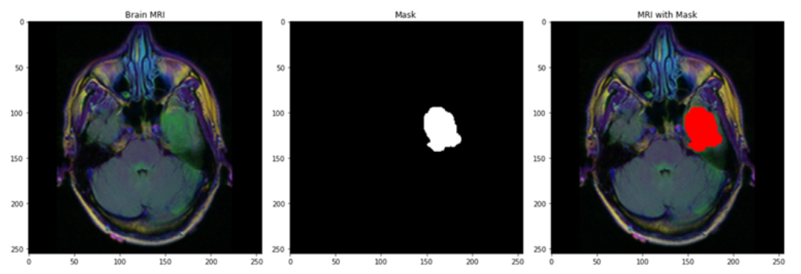
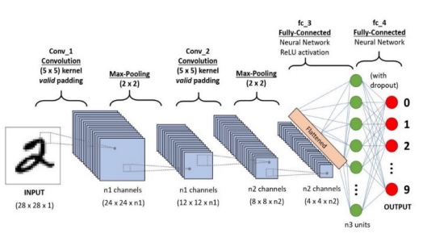
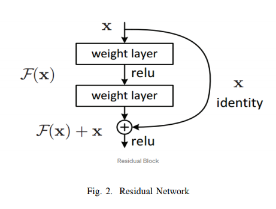
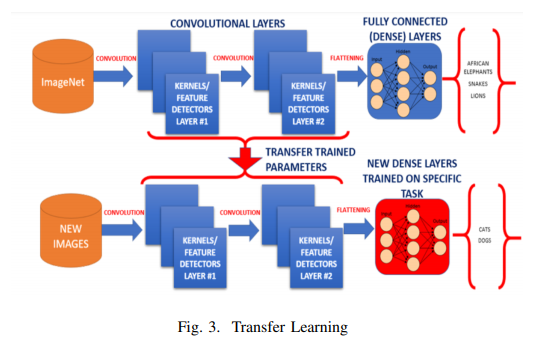
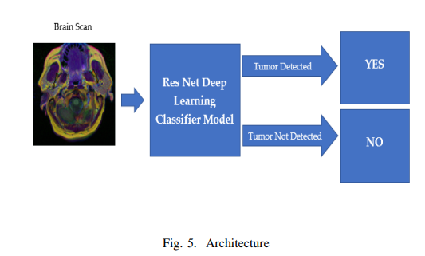
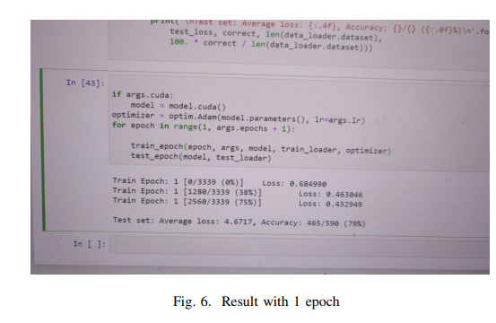

<!-- PROJECT LOGO -->
 

  

> Brain Tumor detection and localization from Brain MRI Scans using Deep Learning Techniques

> Index Terms—Brain Tumor Detection, Deep Learning, Residual Network, Convoluted Neural Network

<!-- ABOUT THE PROJECT -->

## About The Project

### Project Abstract
In recent years there has been growing popularity of Deep Learning in almost every fields where decision making is involved finance, health care, marketing, sales and what not. Deep Learning has shown promising results in the field of healthcare in many areas such as: Disease Diagnosis with Medical Imaging, Surgical Robots, Maximizing Hospital Efficiency. AI healthcare market is expected to reach $45.2 billion USD by 2026 from the current valuation of $4.9 billion USD. Deep learning has been proven to be superior in detecting diseases from X-rays, MRI scans and CT scans which could significantly improve the speed and accuracy of diagnosis.

 In this project there was application of Deep Learning to detect brain tumours from MRI Scan images using Residual Network and Convoluted Neural Networks. This automatic detection of brain tumors can improve the speed and accuracy of detecting and localizing brain tumors based on MRI scans. This would drastically reduce the cost of cancer diagnosis and help in early detection of tumors without any human involvement and would essentially be a life saver. We have also compared the accuracy of results obtained by using two different models - ResNet50 and ResNet18 and used Transfer Learning to tune or freeze weights to evaluate what gives best result.There are 3929 brain MRI scans which are either positive or negative cases of brain tumour. Models were built using ResNet50 and ResNet18 and evaluated their performance in detecting positive or negative cases of brain tumors.

## Related Work

### Image Segmentation

Image Segmentation is a process of classifying every pixel in an image into a designated category. Image Segmentation allows us to understand and extract information from images at the pixel-level. Image Segmentation can be used for object recognition and localization which offers tremendous value in many applications such as medical imaging and selfdriving cars etc. We could use image segmentation to train a neural network to produce pixel-wise mask of the image. Modern image segmentation techniques are based in deep learning approach which makes use of common architectures such as CNN, FCNs(Fully Convolution Networks) and Deep Encoders-Decoders.

### Convolution Neural Network
Convolutional Neural Network (CNN) is a type of deep neural network which has proven to perform well in computer vision tasks such as image classification, object detection, object localization and neural style transfer. CNN extracts features from images, which an algorithm like MLP or RNN can’t achieve. The architecture of a convolutional neural network looks something like this:

We should note a couple of things from this. The network starts off with 2 convolutional and max-pooling layers, followed with 2 fully connected layers which end with an output layer.

### Residual Network
A residual neural network (ResNet) is a kind of artificial neural network which builds on constructs that are known as pyramidal cells found in the cerebral cortex. Residual neural networks do this by making use of skipping connections, or shortcuts to jump over some layers. Usually ResNet models are constructed with multiple layer skips that contain nonlinearities (ReLU) and can also have batch normalization implemented between them. Although traditionally more layers mean a better network but because of the vanishing gradient problem, weights of the first layer won’t be updated correctly through the backpropagation. Since back-propagation of the error gradient is done to earlier layers, repeated multiplication makes this gradient to become really small. Thus, problem can be taken care of by Res-Net solves this problem by using the identity matrix. When the back-propagation is done through identity function, the gradient will be multiplied only by 1 which helps in preserving the input and avoids any loss of information. The network component consists of 3X3 filters, CNN downsampling layers with stride 2, global average pooling layer and a 1000-way fully-connected layer with softmax in the end. ResNet helps in avoiding connection in which an original input is also added to the output of the convolution block which greatly helps to solve the problem of vanishing gradient by allowing an alternative path for the flow of gradient. Another big advantage is that it identifies functions that helps higher layer to perform as good as a lower layer.Traditionally each layer feeds into the next layer. But since this model’s each layer feeds into the next layer and directly into the layers about some hops away.

### Transfer Learning
A major assumption in many machine learning and data mining algorithms is that the training and future data mustbe in the same feature space and have the same distribution. However, in many real-world applications, this assumption may not hold. For example, we sometimes have a classification task in one domain of interest, but we only have sufficient training data in another domain of interest, where the latter data may be in a different feature space or follow a different data distribution. In such cases, knowledge transfer, if done successfully, would greatly improve the performance of learning by avoiding much expensive data-labeling efforts. Humans have an inherent ability to transfer knowledge across tasks. What we acquire as knowledge while learning about one task, we utilize in the same way to solve related tasks. Transfer Learning is a machine Learning technique in which a network that has been trained to perform specific task is being reused as a starting point of another similar task. Transfer Learning is widely used since starting from a pretrained model can dramatically reduce the computational time required if training is performed from scratch [6]. The more related the tasks, the easier it is for us to transfer, or crossutilize our knowledge.Human don’t learn everything from ground but we transfer and leverage our knowledge from the past! Conventional machine learning and deep learning algorithms, so far, have been traditionally designed to work in isolation. These algorithms are trained to solve specific tasks. Transfer learning is a kind of idea where we overcome the isolated learning paradigm and it utilizes knowledge acquired from a completed task. Traditional way of machine learning and deep learning approach thus far have been implemented to work in an isolated manner and solve only specific kind of tasks. Every time the models needed to be rebuilt from scratch once the feature-space distribution changes. Transfer learning is a novel approach which helps to overcome the issues of overcoming isolated learning paradigm and utilizing knowledge acquired for one task to solve related ones [1].

One of the major use case of deep learning is the fact that most models solve very difficult problems and need a whole lot of data. Since it can features of it’s own, thus it eliminates problems of labeling data that is usually done for supervised learning problems in machine learning.

##  DATA FORMATTING
Work was done on 3929 Brain MRI Scans. These are image files that contain the actual data of patients brain MRI scans and the information if they were analyzed by the doctor to have tumors or not. The data was converted into .png format and we ran the machine learning algorithm in all those images. We have built two different models - one using ResNet50 and the other using ResNet18, and also tuned certain hyper parameters to assess and compare the results of all the approaches. 85% of the data was used to train the model and the rest 15% of the data was used for testing.

###  PROPOSED METHOD
Brain MRI Scans were used images as dataset to train the machine and test our machine learning model. We used multiple features to run our model and using Residual Networks we classified if the MRI scans would be classified to have tumors or not. We used 2 different models (ResNets) - ResNet50 and ResNet18 to classify the MRI scans to either contain tumors or not and tuned multiple hyper parameters in transfer learning- a. Freeze the trained CNN network weights from the first  layers, only train the newly added dense layers(with randomly initialized weights). b. Initialize the CNN network with the pre-trained weights and retrain the entire CNN network while setting the learning rate to be very small, this is critical to ensure that you do not aggressively change the trained weights.

## PROPOSED METHOD IMPLEMENTATION RESULT

Series of experiments were conducted and the results of those experiments have been attached here at the end. The results were then compared, and we found the following - By comparing experiment 1 and 3, where we changed the model from ResNet50 to ResNet18, we show that we achieved 1% improvement. this improvement is because ResNet18 has less number of parameters and since our data is small, ResNet50 gets overfitted to the data. By tuning the Neural Network hyperparameters we achived 96% accuracy for ResNet18 and 94% accuracy for ResNet50. In the next experiments we have fixed these hyperparameters and normalized our data with mean = [0.485,0.456,0.406] and std= [0.229,0.224,0.225]. we show that our accuracy dropped from 96% to 92% for ResNet18 and improved by 1% for ResNet50. comparing experiment 13 and 15 shows that by adding random horizantal flipping and removing the normalization, the ResNet18 acieves a better performance. For the last experiment we have added random horizantal flipping and normalization. As the result of experiment 19 and 20 shows, we have achived our best performance for both ResNet50 and ResNet18. We achieved the best results for a train batch size of 8 and test batch size of 8 with 30 epochs and Learning rate of 0.0001 and momentum of 0.5, with added layers of Linear RELU Dropout Linear Dropout Linear, and a transform on the dataset with a resize factor of 224 and Random Horizontal Flip we achieved an accuracy of 97% using a ResNet18 model and an accuracy of 96% using ResNet50 model.

## Bibliography
[1] Dipanjan Sarkar. ”A Comprehensive Hands-on Guide to Transfer Learning with Real-World Applications in Deep Learning”

[2] S. J. Pan and Q. Yang, ”A Survey on Transfer Learning,” in IEEE Transactions on Knowledge and Data Engineering

[3]  Ying Tai, Jian Yang, Xiaoming Liu; Proceedings of the IEEE Conference on Computer Vision and Pattern Recognition (CVPR), 2017

[4] https://docs.aws.amazon.com/emr/latest/ManagementGuide/emrmanaged-notebooks.html

[5] Simard, Patrice Y., David Steinkraus, and John C. Platt. ”Best practices for convolutional neural networks applied to visual document analysis.” Icdar. Vol. 3

[6] Alom, Md. Zahangir Taha, Tarek Yakopcic, Christopher Westberg, Stefan Hasan, Mahmudul Esesn, Brian Awwal, Abdul Asari, Vijayan. (2018). The History Began from AlexNet: A Comprehensive Survey on Deep Learning Approaches.

<!-- CONTACT -->

## Contact

Pritom Das Radheshyam - [Portfolio Website](https://pritom.uwu.ai/)
[![LinkedIn][linkedin-shield]][linkedin-url]  

<!-- MARKDOWN LINKS & IMAGES -->
<!-- https://www.markdownguide.org/basic-syntax/#reference-style-links -->

[linkedin-shield]: https://img.shields.io/badge/-LinkedIn-black.svg?style=flat-square&logo=linkedin&colorB=555
[linkedin-url]: https://www.linkedin.com/in/you-found-pritom
[product-screenshot]: images/screenshot.jpg
